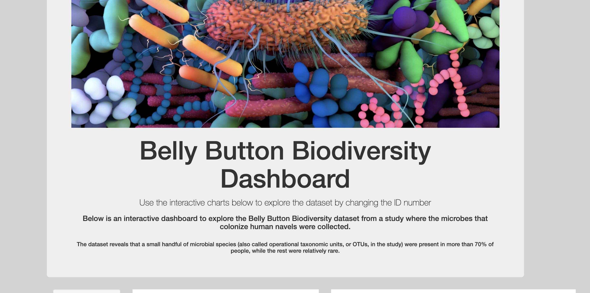
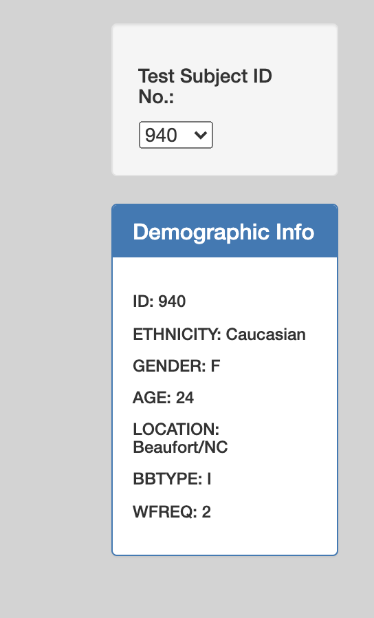
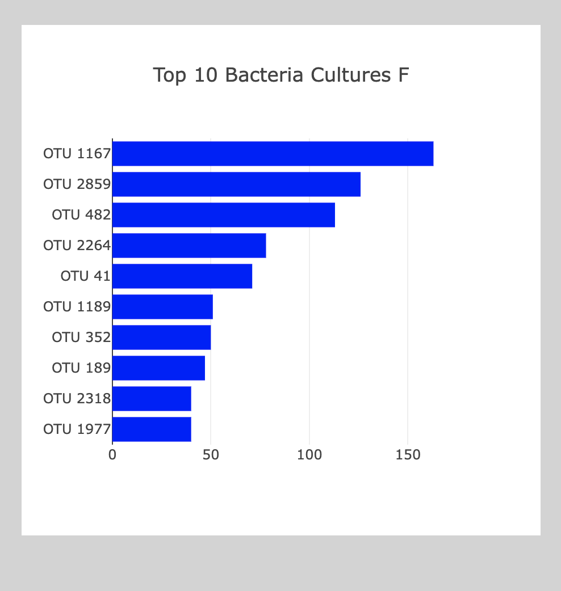
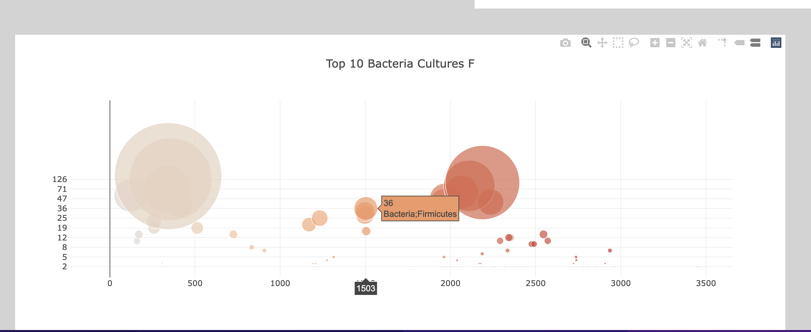
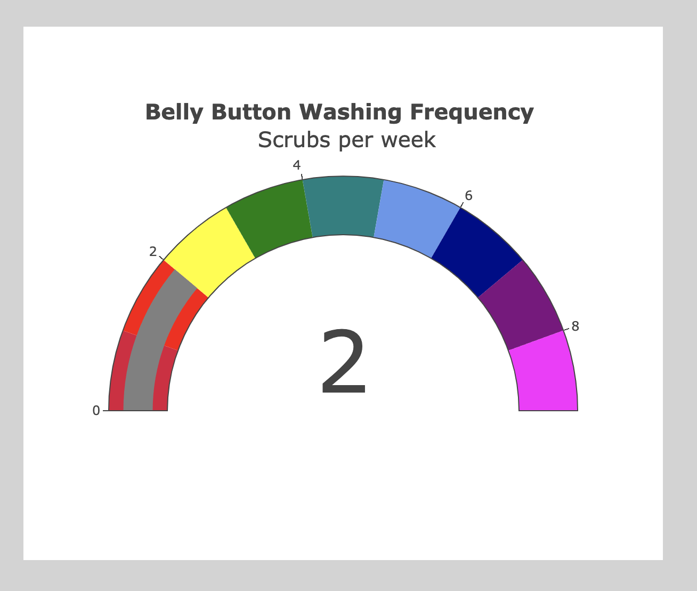

# Belly Button Biodiversity Dashboard
Interactive dashboard used to explore and display bar chart, gauge chart, and bubble chart for ID selected from the provided dataset. 

## Overview of Project
In this project, we used a data set provided in a json file which catalogs the microbes that colonize human navels. With this data, we created an interactive web application that allows users to select an ID from a dropdown menu that then populates the website with a Bubble Chart, Bar Chart, and Gauge Chart from the data associated with the selected ID number. The bar and bubble charts display data about the operational taxonomic units, or OTUs of the microbial species collected from the participants belly buttons. The gauge chart displays the frequency that the participant washed their belly button during a given week. 

### Charts Created 
For this Dashboard we created various charts for the data provided. 

### First, we created a table to display the demographic data of the participant. 

### We also create a bar chart of the top 10 OTUs from the chosen ID. 

### A Bubble chart that displays all of the OTUs for the chosen ID was also included. 

### A gauge chart that displays the frequency that the chosen ID washes their belly button during a given week was also added. 

